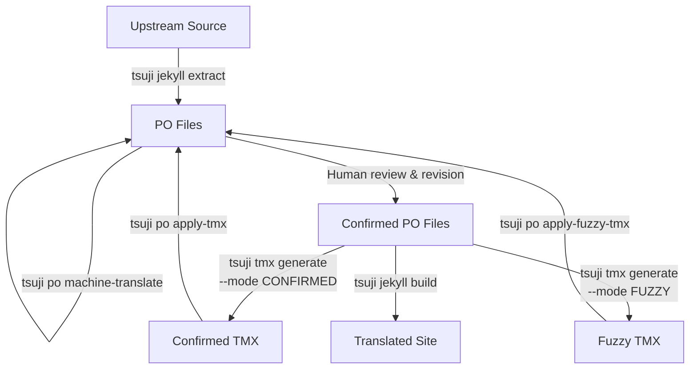

# tsuji Architecture Guide

## 1. Project Overview

tsuji is a localization toolkit designed for translating the [quarkus.io](https://quarkus.io) documentation site. Through gettext PO files, it combines LLM-based translation (Google Gemini / OpenAI) or machine translation API (DeepL) with Retrieval-Augmented Generation (RAG) powered by existing Translation Memory (TMX) files, providing a consistent translation process.

**Tech Stack**: Kotlin / Quarkus / LangChain4j / PicocLI / JDK 21

## 2. Translation Workflow

tsuji is a collection of subcommands that support the entire translation process. The expected workflow consists of three phases.

### 2.1 Sync Phase — Incorporate Upstream Updates and Generate Draft Translations

This phase reflects upstream repository updates into translation PO files and prepares draft translations via machine translation.

1. **PO file extraction** — Extracts text from upstream sources and stores them as translation units (messages) in PO files. The main .adoc files are extracted by the Jekyll plugin (jekyll-l10n) during the Jekyll build process, while auxiliary files such as .md and .yaml are processed by po4a. New and updated messages are added to the PO files. Handled by the `tsuji jekyll extract` command.
2. **Confirmed translation memory application** — Applies previously human-confirmed translations (TMX) to PO files, automatically reusing translations for messages with identical source text. Handled by the `tsuji po apply-tmx` command.
3. **Fuzzy translation memory application** — Loads previously machine-translated but unconfirmed messages (fuzzy) from the fuzzy TMX and applies them to PO files. This avoids redundant machine translation of the same messages. Handled by the `tsuji po apply-fuzzy-tmx` command.
4. **Machine translation** — Applies machine translation via LLM (Gemini / OpenAI) or DeepL to messages that remain untranslated after the previous steps. Results are saved with the fuzzy flag and confirmed after human review. Handled by the `tsuji po machine-translate` command.

### 2.2 Translation & Review Phase — Human Confirmation

Translators edit PO files to review and revise machine-translated drafts. Removing the fuzzy flag confirms the translation. tsuji does not directly handle this phase but provides supporting commands:

- **Clearing translations** — Deletes translations and resets messages to an untranslated state. Handled by the `tsuji po purge` command (`--all` to clear all translations including confirmed ones).
- **PO syntax normalization** — Unifies PO file formatting via msgcat. This prevents unnecessary diffs when committing to a git repository. Handled by the `tsuji po normalize` command.

### 2.3 Build & Deploy Phase — Building the Translated Site

This phase updates translation memory from confirmed translations, then builds and publishes the site.

1. **Translation memory regeneration** — Generates TMX from confirmed PO files. The generated TMX is reused in the next sync phase, allowing confirmed translations to accumulate as translation assets. Handled by the `tsuji tmx generate` command.
2. **Translation statistics update** — Aggregates PO file translation progress and override file freshness, and outputs CSV reports. Handled by the `tsuji jekyll update-stats` command.
3. **Site build** — Applies PO translations to upstream source files and generates the translated Jekyll site. Handled by the `tsuji jekyll build` command.
4. **Local preview** — Previews the built site on a local server. Handled by the `tsuji jekyll serve` command.

### Data Flow Overview



## 3. System Architecture

### 3.1 Multi-Module Structure

```
tsuji (root)         — Main CLI application
├── tsuji-po         — PO file domain model and I/O (jgettext)
└── tsuji-tmx        — TMX file domain model and I/O (Jackson XML)
```

`tsuji-po` and `tsuji-tmx` are domain model libraries with no external tool dependencies, referenced by the root module. They are specialized for file format parsing and generation, and contain no translation logic.

### 3.2 Layer Architecture (Root Module)

The root module is organized in three layers. Each layer depends only on layers below it.

```
CLI (PicocLI)
  ↓
App Service Layer (net.sharplab.tsuji.app.service)
  ↓
Core Service Layer (net.sharplab.tsuji.core.service)
  ↓
Core Driver Layer (net.sharplab.tsuji.core.driver)
```

**App Service Layer** — Handles use case orchestration and workflow sequencing. Called from CLI commands, it combines Core Services and Core Drivers to execute operations.

| Class | Responsibility |
|---|---|
| `TranslationAppService` | Machine translation execution (file scanning, language code resolution, parallel processing) |
| `PoAppService` | PO file extraction, TMX application, statistics generation |
| `TmxAppService` | TMX generation and application orchestration |
| `JekyllAppService` | Jekyll build, serve, and statistics update |

**Core Service Layer** — Contains pure domain logic with no external dependencies.

| Class | Responsibility |
|---|---|
| `PoTranslatorService` | Translation application to PO (Translator invocation, TMX index application) |
| `PoService` | Translation statistics calculation (message count, word count) |
| `TmxService` | TMX generation logic from PO files |
| `JekyllService` | Override file freshness determination |

**Core Driver Layer** — Handles integration with external systems.

| Class | Responsibility |
|---|---|
| `Translator` | Translation engines (Gemini / OpenAI / DeepL) |
| `PoDriver` | PO file read/write (jgettext) |
| `TmxDriver` | TMX file read/write (Jackson XML) |
| `Po4aDriver` | po4a command invocation |
| `JekyllDriver` | Jekyll / Bundle command invocation |
| `VectorStoreDriver` | Lucene vector index management |
| `GitTimestampDriver` | File timestamp retrieval via GitHub API |

### 3.3 Dependency Injection

DI uses Quarkus Arc, with bean creation logic centralized in the `TsujiBeans` class. Translation engine selection (switching between Gemini / OpenAI / DeepL via `tsuji.translator.type`) and model configuration are also resolved here.

## 4. Extraction from Upstream

The `tsuji jekyll extract` command extracts text from upstream Jekyll sources and stores them as PO files. Extraction is performed in two stages.

### 4.1 Extraction Process

#### Auxiliary File Extraction via po4a

First, the upstream source directory is copied to a temporary working directory, and override files from `l10n/override/` are applied on top. Then the files in the working directory are scanned and text is extracted using po4a.

File formats processed by po4a are determined by file extension:

| Extension | po4a Format |
|---|---|
| `.md`, `.markdown` | `text` (markdown mode) |
| `.yml`, `.yaml` | `yaml` |
| `.html` | `xhtml` |

`.adoc` files are skipped at this stage because they are handled by the Jekyll plugin. While po4a does have an AsciiDoc parser, its parser limitations cause accuracy issues with text extraction. The Jekyll plugin can traverse the document object model during the site build process, achieving full extraction accuracy.

YAML and HTML have configurable extraction filters:
- **YAML**: Files specified in `jekyll.extract.yaml.exclude` are excluded (e.g., `_data/navigation.yml`)
- **HTML**: Only files specified in `jekyll.extract.html.include` are extracted (whitelist approach)

#### AsciiDoc Extraction via Jekyll Plugin

After po4a extraction, the Jekyll build process is executed with the `L10N_MODE=update_po` environment variable. The Jekyll plugin (jekyll-l10n) extracts text from .adoc files during the build and stores them in PO files.

Environment variables passed to the Jekyll plugin:
- `L10N_MODE=update_po` — Run in extraction mode
- `L10N_PO_BASE_DIR` — Output directory for PO files
- `L10N_LANGUAGE` — Target language (POSIX format, e.g., `ja_JP`)

### 4.2 PO Domain Model (tsuji-po Module)

Extracted translation data is managed as PO files.

- **Po**: Immutable data class representing an entire PO file (target, messages, header)
- **PoMessage**: Per-message model (messageId, messageString, flags, comments, sourceReferences)
- **PoCodec**: PO file read/write via the jgettext library
- **MessageClassifier**: Utility that identifies messages not requiring translation, such as technical identifiers and paths (~30 patterns)

## 5. Translation Memory (TMX)

Translation Memory (TMX) is a mechanism for accumulating and reusing past translations.

### 5.1 TMX Generation

The `tsuji tmx generate` command scans PO files, collects messages, and outputs them in TMX 1.4 format. There are two modes:

- **CONFIRMED mode**: Extracts only human-confirmed translations (non-fuzzy). Reused via `tsuji po apply-tmx` during the next sync.
- **FUZZY mode**: Extracts only machine translation results (fuzzy). Reused via `tsuji po apply-fuzzy-tmx` during the next sync, preventing redundant machine translation of the same messages.

Filtering during generation:
- Header messages (empty messageId) are skipped
- Untranslated messages (empty messageString) are skipped
- When the same source text exists across multiple PO files, the first translation found is used (deduplication)
- Translation units are sorted alphabetically by source text (for diff stability)

### 5.2 TMX Application

- **`tsuji po apply-tmx`**: Applies confirmed TMX to PO files. Applied translations are marked as confirmed (non-fuzzy).
- **`tsuji po apply-fuzzy-tmx`**: Applies fuzzy TMX to PO files. Applied translations are marked as fuzzy.

Neither operation overwrites messages that already have confirmed translations (only fuzzy or untranslated messages are targeted). PO files are processed in parallel.

### 5.3 TranslationIndex — Two-Stage Lookup

TMX application uses `TranslationIndex` (a HashMap-based source→translation map) for fast lookup. Lookup is performed in two stages:

1. **Exact match**: Looks up the source text as-is
2. **Normalized match**: Replaces newlines with spaces and collapses consecutive spaces, then looks up the normalized key

This two-stage lookup allows translation reuse even when whitespace formatting differs between PO files and TMX entries.

### 5.4 TMX Domain Model (tsuji-tmx Module)

Provides domain model and I/O for TMX 1.4. Parsing and saving use Jackson XML.

- **Tmx**: TMX 1.4 document (version, header, body)
- **TmxHeader**: Metadata (creationTool, srcLang, adminLang, etc.)
- **TranslationUnit**: Translation unit (source/target language variant pair)
- **TranslationUnitVariant**: Language variant (lang, seg)
- **TranslationIndex**: Two-stage lookup index described above

## 6. Machine Translation

Machine translation is the core feature of tsuji. The `tsuji po machine-translate` command translates untranslated messages in PO files.

### 6.1 Translator Interface

```kotlin
interface Translator {
    suspend fun translate(
        po: Po, srcLang: String, dstLang: String,
        isAsciidoctor: Boolean, useRag: Boolean
    ): Po
}
```

Takes an entire PO file (`Po`) as input and returns a translated `Po`. There are three implementations:

| Implementation | Translation Engine | RAG Support | Markup Protection Strategy |
|---|---|---|---|
| `GeminiTranslator` | Google Gemini (LangChain4j) | Yes | Native AsciiDoc + post-validation |
| `OpenAiTranslator` | OpenAI (LangChain4j) | Yes | Native AsciiDoc + post-validation |
| `DeepLTranslator` | DeepL API | No | AsciiDoc → HTML round-trip |

The implementation is selected by the `tsuji.translator.type` config value (branching in `TsujiBeans.translator()`).

### 6.2 MessageProcessor Pipeline

Each Translator performs translation through a pipeline of `MessageProcessor` interfaces.

```kotlin
interface MessageProcessor {
    suspend fun process(
        messages: List<TranslationMessage>,
        context: TranslationContext
    ): List<TranslationMessage>
}
```

Each processor receives the entire message list and returns a new processed list without modifying the original. Since each processor is implemented as a pure function with a single responsibility, individual testing and adding new processors are straightforward. The pipeline composition differs significantly between translation engines (described below).

### 6.3 TranslationMessage Working Model

During pipeline processing, a dedicated working model `TranslationMessage` is used instead of `PoMessage` (the persistence domain model). This keeps the domain model's responsibilities pure.

```kotlin
data class TranslationMessage(
    val original: PoMessage,        // Original PoMessage (reference, immutable)
    val text: String,               // Working text during pipeline processing
    val fuzzy: Boolean,             // Fuzzy flag
    val needsTranslation: Boolean,  // Whether translation is needed (determined at initialization)
    val additionalComments: List<String>
)
```

- `from(PoMessage)`: Initializes messages with empty messageString as translation targets. Sets `messageId` (source text) as the working text.
- `withText()` / `withFuzzy()`: Immutable updates that return new instances.
- `toPoMessage()`: Converts the processed result back to `PoMessage`.

### 6.4 Message Classification

`AbstractLangchain4jTranslationProcessor` classifies messages into three categories before translation:

| Category | Criteria | Processing |
|---|---|---|
| **fill** | `MessageClassifier.shouldFillWithMessageId()` | Uses messageId as-is (technical identifiers, paths, etc.; ~30 patterns) |
| **Jekyll Front Matter** | `MessageClassifier.isJekyllFrontMatter()` | Translates only title/synopsis fields individually, with fuzzy flag |
| **normal** | All others | Batch translation (described below) |

### 6.5 LLM Translation (Gemini / OpenAI)

Gemini and OpenAI can understand AsciiDoc markup directly, so HTML conversion is unnecessary. Both share the same pipeline structure.

```
PoMessage → TranslationMessage conversion
  ↓
1. GeminiTranslationProcessor / OpenAiTranslationProcessor   — Batch translation + message classification
2. XrefTitlePostProcessor                                    — <<Title>> → <<section-id,translated title>> conversion
  ↓
TranslationMessage → PoMessage restoration
```

`GeminiTranslationProcessor` and `OpenAiTranslationProcessor` inherit from the shared base class `AbstractLangchain4jTranslationProcessor`, sharing batch processing, validation, retry, and escalation logic. The only difference is the translation API call.

Each translated message is tagged with a comment such as `mt: gemini` / `mt: openai` / `mt: deepl`. This tag is used by the `--accept-mt` option during site build (Section 7.2) to control which MT engine's fuzzy translations are included in the build.

#### Batch Translation and Structured Output

Normal messages are sent to the LLM in batches. Multiple texts are sent as a JSON array. `MessageTypeNoteGenerator` attaches translation guidance based on message type (e.g., headings):

```json
[
  {"index": 0, "text": "First text to translate"},
  {"index": 1, "text": "= Getting Started", "note": "This is a heading. Translate using nominal phrase style."}
]
```

LangChain4j's `ResponseFormat` specifies a JSON Schema to structure LLM output:

```json
{
  "translations": [
    {"index": 0, "translation": "Translated text"},
    {"index": 1, "translation": "Getting Started"}
  ]
}
```

`TranslationAiService` parses the response and validates index matching. An exception is thrown if indices don't match.

#### System Prompt

`TranslationAiService` builds the system prompt using a template approach:

```
Translation System Prompt (template)
  ├── {srcLang} → Source language code
  ├── {dstLang} → Target language code
  ├── {glossary} → Glossary (injected only when enabled)
  └── {additional_rules} → AsciiDoc / HTML markup rules (switched based on content type)
```

Each template uses built-in files from the classpath by default, but can be overridden by specifying external file paths in configuration. When the glossary is enabled, term-translation pairs defined in configuration are injected into the prompt.

#### Markup Protection (Post-Validation)

LLMs are instructed via the prompt to preserve AsciiDoc markup, but since LLM output is non-deterministic, `AsciidocMarkupValidator` verifies translations after the fact.

**Validation steps**:
1. Convert both source and translated text to HTML using AsciidoctorJ
2. Parse the DOM with jsoup and extract markup features:
   - Set of link `href` values
   - Set of image `src` values
   - Count and text content of `<em>`, `<strong>`, `<code>` elements
3. Compare features between source and translation; throw `AsciidocMarkupValidationException` on mismatch

#### Escalation Model Retry

When markup corruption is detected, only the broken messages are retranslated (up to `max-message-validation-retries` times, default 4). The following information is provided to the LLM during retranslation:

- Source text
- Previous translation result (`previousTranslation`)
- Detailed description of the corruption (which markup mismatches, CJK spacing rule notes, etc.)

If an escalation model is configured, retries switch from the primary model to the escalation model. This enables using a cost-effective model (e.g., Gemini Flash) for initial translation while only using a higher-quality model (e.g., Gemini Pro) for retries.

If the issue still cannot be resolved, a warning comment is added and processing continues.

#### RAG-Enhanced Batch Translation

When RAG is enabled, `RAGTranslationAiService` is used. For each text, similar translations are retrieved via vector search and included as a `tm` field in the request:

```json
[
  {
    "index": 0,
    "text": "First text to translate",
    "tm": [
      {"original": "similar source", "translation": "similar translation"}
    ]
  }
]
```

The system prompt instructs that `tm` is only a terminology reference and copying sentence structure is prohibited. Details of RAG index construction and search are described in the RAG section below.

### 6.6 DeepL Translation

DeepL is a plain-text API, so pre-processing and post-processing are needed to protect AsciiDoc markup. The pipeline consists of 11 processors.

```
PoMessage → TranslationMessage conversion
  ↓
1.  AsciidoctorPreProcessor       — AsciiDoc → HTML conversion (AsciidoctorJ + custom templates)
2.  DeepLTranslationProcessor     — Translation via DeepL API (HTML tag structure is preserved)
3.  LinkTagMessageProcessor       — <a href="..."> → xref/link syntax
4.  ImageTagMessageProcessor      —  → image:path[] syntax
5.  DecorationTagMessageProcessor — <em> → _text_
6.  DecorationTagMessageProcessor — <strong> → *text*
7.  DecorationTagMessageProcessor — <monospace> → `text`
8.  DecorationTagMessageProcessor — <superscript> → ^text^
9.  DecorationTagMessageProcessor — <subscript> → ~text~
10. DecorationTagMessageProcessor — <code> → `text`
11. CharacterReferenceUnescaper   — HTML character reference unescaping
  ↓
TranslationMessage → PoMessage restoration
```

The design rationale is that Gemini/OpenAI can be instructed via prompts to preserve AsciiDoc markup, while DeepL is a simple text translation API that requires converting markup to HTML tags for protection and restoring them to AsciiDoc after translation.

DeepL does not support RAG. If `useRag=true` is specified, a warning log is emitted and the flag is ignored.

### 6.7 Adaptive Concurrency Control

To efficiently translate large volumes of PO files, control is applied across three axes: **file-level parallel processing**, **API request concurrency**, and **batch size**.

#### File-Level Parallel Processing

`TranslationAppServiceImpl` translates PO files in parallel using Kotlin Flow's `flatMapMerge(concurrency = 30)`. Batch translations within each file are globally concurrency-limited by `AdaptiveParallelismController`'s Semaphore, so file-level parallelism and API request-level concurrency are controlled independently.

#### API Concurrency Control — AdaptiveParallelismController

Dynamically adjusts request concurrency in response to API rate limits.

**Core idea: Semaphore reserved permit approach**

A Semaphore is initialized with the maximum concurrency (e.g., 60), and unused permits are held as "reservations." This allows dynamic adjustment of effective concurrency without recreating the Semaphore.

```
With max 60 permits, initial concurrency 40:
  → Reserve 20 permits at startup (acquire)
  → Decrease concurrency: reserve 1 additional permit (keep)
  → Increase concurrency: release 1 reserved permit (release)
```

**AIMD algorithm**:
- **Additive Increase**: +1 concurrency after 10 consecutive successes (release 1 reserved permit)
- **Multiplicative Decrease**: -1 concurrency on rate limit error (429) (hold permit as reserved)

On rate limit errors, permits are held rather than released, naturally reducing effective concurrency.

#### Batch Size Control — BatchProvider

Adaptively adjusts the number of texts per request.

**AIMD algorithm**:
- **Additive Increase**: +1 to size limit per successful batch
- **Multiplicative Decrease**: ×0.5 to size limit on validation error

Both initial and maximum sizes are configurable (default: 200).

#### BatchedExecutor

`BatchedExecutor` coordinates with `BatchProvider` to control batch processing and retries:

- `peekNext()`: Gets the next batch without advancing position
- On success: `consumeNext()` advances position, `notifySuccess()` increases size
- On validation error: `notifyValidationError()` reduces size and retries from the same position (up to `max-message-validation-retries` times)
- On general error: Retries the same batch with exponential backoff (up to `max-retries` times)

The three layers of control work together as follows:

```
TranslationAppServiceImpl
  flatMapMerge(concurrency=30) for parallel PO file processing
    ↓
AbstractLangchain4jTranslationProcessor
  BatchedExecutor manages batch splitting and retries
    ↓
  AdaptiveParallelismController.execute { batch translation }
    Semaphore for global concurrency control
```

### 6.8 RAG (Retrieval-Augmented Generation)

Vectorizes existing translation assets (TMX) and retrieves similar past translation pairs during translation to inject into prompts.

#### Index Construction

```
TMX File
  ↓ TmxDriver.load()
Tmx Model
  ↓ IndexingService.convertToSegments()
List<TextSegment>   — Source text as text, translation as metadata ("target")
  ↓ VectorStoreDriver.addAll() or updateIndexWithDiff()
Lucene Vector Index (l10n/rag/index/)
```

- **Embedding model**: AllMiniLmL6V2QuantizedEmbeddingModel (ONNX, local execution)
- **Storage**: Apache Lucene (`LuceneVectorStoreDriver`)
- **Deduplication**: Generates SHA-256 hash from segment content (source + translation + language) as a content-based ID. Segments with identical content produce the same ID, preventing duplicates via `updateDocument()` upsert.
- **Differential update**: `updateIndexWithDiff()` compares existing index ID sets with new segment ID sets, performing only additions and deletions.

#### Search During Translation

`RAGTranslationAiService` searches for similar translations per text using `EmbeddingStoreContentRetriever`.
- **Max results**: Configurable (default: 3)
- **Min score**: Configurable (default: 0.5)

## 7. Site Build

The `tsuji jekyll build` command builds the translated Jekyll site.

### 7.1 Build Process

1. **Source preparation** — Copies the upstream source directory to a temporary working directory
2. **Override application** — Overwrites files from the `l10n/override/` directory into the working directory. This mechanism applies manually translated versions of HTML templates and other files that cannot be processed by po4a
3. **PO translation application** — Uses po4a to apply PO translations to .md / .yaml / .html files (.adoc files are handled by the Jekyll plugin)
4. **Jekyll build** — Runs Jekyll with the `L10N_MODE=translate` environment variable to generate the translated site. The Jekyll plugin (jekyll-l10n) handles applying translations to .adoc files during the build

### 7.2 Selective Machine Translation Acceptance (accept-mt)

Recent LLM-based machine translations such as Gemini have sufficiently high translation quality that unreviewed translations may be acceptable for the site. The `--accept-mt` option allows treating fuzzy translations from specific MT engines as confirmed during the build (e.g., `--accept-mt gemini,deepl`).

Machine translation results have comments like `mt: gemini` or `mt: deepl` attached to PO messages. Fuzzy translations from engines specified in `--accept-mt` are reflected as confirmed during the build. This allows controlling whether unreviewed machine translations are included in the build.

### 7.3 Override Freshness Tracking

Override files need to keep up with upstream updates. The `tsuji jekyll update-stats` command uses the GitHub API to compare the last commit dates of override files and their corresponding upstream files, determining freshness.

- **OK**: Override was last updated after the upstream file (up to date)
- **NG**: Upstream was updated after the override (stale)

Results are output to `override.csv`. When stale files are found, GitHub Actions automatically creates an Issue.

### 7.4 Translation Statistics

The `tsuji jekyll update-stats` command also generates translation progress statistics for PO files. For each PO file, it calculates the following metrics and outputs CSV files by directory:

- **Fuzzy message count / total message count**
- **Fuzzy word count / total word count**
- **Achievement rate** (`100 - fuzzyWords * 100 / totalWords`)

Output is split by directory: `_guides`, `_versions` (per version), `_posts`, `_includes`/`_data`, etc.

### 7.5 Local Preview

The `tsuji jekyll serve` command performs the same preparation as `jekyll build` and then starts the Jekyll development server.
